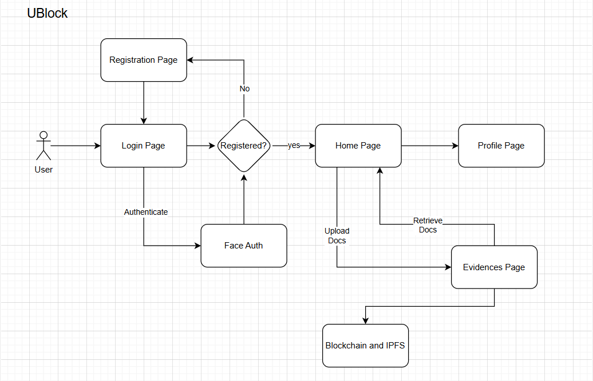

# 🛡️ Evidence Management System powered by Blockchain & AI/ML

<p align="center">
  <a href="https://github.com/Sumeets-Code/UBlock/stargazers">
    
  </a>
  <a href="https://github.com/Sumeets-Code/UBlock/network/members">
    
  </a>
  <a href="https://github.com/Sumeets-Code/UBlock/blob/main/LICENSE">
    
  </a>
  
  
</p>

A **secure, tamper-proof, and intelligent evidence management platform** that leverages **Blockchain technology** for integrity, **IPFS** for decentralized storage, and **AI/ML** for real-time intruder identification.  
In case of unauthorized access, the system captures a **photo of the intruder**, checks **criminal records**, and alerts the authorities.


## 🚀 Features

- **Immutable Blockchain Ledger** – Ensures that evidence records cannot be altered or deleted.
- **Decentralized Storage with IPFS** – Stores large files securely and makes them accessible only to authorized personnel.
- **Intruder Detection** – Captures photos upon unauthorized access attempts.
- **AI/ML Criminal Record Check** – Uses facial recognition to match intruder photos with a criminal database and Face Lock feature.
- **Real-Time Alerts** – Notifies security authorities in case of a security breach.
- **Role-Based Access Control** – Only authorized users can view or upload evidence.


## 🏗️ Tech Stack

**Frontend:**
- React.js
- Tailwind CSS

**Backend:**
- Node.js
- Express.js

**Blockchain:**
- Ethereum Smart Contracts (Solidity)
- Hardhat
- Web3.js

**Storage:**
- IPFS (InterPlanetary File System)

**AI/ML:**
- Python (Face Recognition / Deep Learning Models)
- OpenCV
- TensorFlow / PyTorch

**Database:**
- MongoDB / PostgreSQL


## System Design



## 📌 Project Architecture

```bash
UBlock/
├── backend/
│   ├── api/                         # Express-based API service
│   │   ├── server.js                # Entry point for Express server
│   │   ├── routes/                  # API routes for various modules
│   │   │   ├── auth.js              # Authentication & login routes (MongoDB)
│   │   │   ├── evidence.js          # Evidence management routes (MongoDB)
│   │   │   ├── ipfs.js              # New routes for IPFS operations
│   │   │   └── blockchain.js        # Routes for blockchain operations
│   │   ├── models/                  # Database models/schemas
│   │   │   ├── user.model.js        # MongoDB user login info
│   │   │   └── evidence.model.js    # MongoDB evidence documents
│   │   ├── Downloads/               # All the files downloaded from IPFS
│   │   └── config/                  # Configuration files (DB connections, env variables)
│   ├── ml_service/                  # Machine Learning service for intrusion detection
│   │   ├── index.js                 # ML service entry (or proxy to a Python microservice)
│   │   └── models/                  # ML models and related code
│   ├── blockchain/                  # Blockchain integration using Ethereum
│   │   ├── contracts/               # Solidity smart contracts (e.g., EvidenceProtection.sol)
│   │   ├── hardhat.config.js        # Hardhat configuration for contract development
│   │   ├── scripts/                 # Deployment & interaction scripts for contracts
│   │   └── tests/                   # Unit/integration tests for smart contracts
│   ├── ipfs_service/                # New IPFS service for handling file storage
│   │   ├── index.js                 # Entry point for IPFS service
│   │   ├── upload.js                # Functions for uploading file to IPFS
│   │   ├── retrieve.js              # Functions for retrieving files from IPFS
│   │   └── config.js                # Configuration for IPFS (e.g., node address)
│   ├── email_service/               # New email service for handling email operations
│   │   ├── sendEmail.js             # Functions for sending emails
│   │   └── config.js                # Configuration for email service (SMTP settings)
│   └── package.json                 # Node.js package configuration for backend
│
├── frontend/
│   └── react_app/                   # React-based frontend application
│       ├── public/
│       ├── src/
│       │   ├── components/          # Reusable UI components
│       │   ├── pages/               # Page-level components/views
│       │   ├── services/            # API service calls to the backend
│       │   ├── App.js
│       │   └── index.js
│       └── package.json             # Node.js package configuration for frontend
├── docs/                            # Documentation and project artifacts
│   ├── architecture.md
│   ├── requirements.md
│   └── README.md
├── tests/                           # Global tests (unit, integration, end-to-end)
│   ├── backend_tests/
│   ├── frontend_tests/
│   └── blockchain_tests/
└── docker-compose.yml               # Container orchestration for multi-service setup

```

---

## ⚙️ Installation

1. **Clone the Repository**

   ```bash
   git clone https://github.com/Sumeets-Code/UBlock.git
   cd UBlock
   ```

2. **Install Dependencies**

   ```bash
   # Backend
   cd backend
   npm install

   # Frontend
   cd ../frontend
   npm install
   ```

3. **Configure Environment Variables**
   Create `.env` files in both backend and frontend with:

   ```env
   MONGO_URI=your_mongodb_connection
   INFURA_API_KEY=your_infura_key
   IPFS_API_URL=ipfs_gateway_url
   AI_MODEL_PATH=model_directory_path
   ```

4. **Deploy Smart Contracts**

   ```bash
   cd backend
   npx hardhat run scripts/deploy.js --network <network_name>
   ```

5. **Run the Project**

   ```bash
   # Backend
   cd backend
   npm run dev

   # Frontend
   cd ../frontend
   npm start
   ```

---

## 🧠 AI/ML Component

The AI/ML module:

* Uses **facial recognition** to identify intruders.
* Matches the captured face against **criminal databases**.
* Generates a **threat score** and sends alerts.

> Model trained on [LFW Dataset](http://vis-www.cs.umass.edu/lfw/) and fine-tuned for law enforcement datasets.

---

## 🔒 Security Measures

* **End-to-End Encryption** of all data transfers.
* **Multi-Signature Authorization** for evidence approval.
* **Blockchain Audit Trails** for transparency.
* **Decentralized Access Logs** to prevent tampering.

---

## 📸 Screenshots

| Unauthorized Access Detected           | Evidence Blockchain Record                      |
| -------------------------------------- | ----------------------------------------------- |
|  |  |

---

## 📜 License

This project is licensed under the **MIT License**.

---

## 🤝 Contributors

* **Your Name** – Lead Developer
* **Team Members** – Blockchain, AI/ML, and Security

---

## 📬 Contact

For queries, reach out at:
📧 **[sumeetbhagat1811@gmail.com](mailto:sumeetbhagat1811@gmail.com)**
🔗 [LinkedIn](https://linkedin.com/in/yourprofile)

---

```

---

If you want, I can also create **GitHub repo badges** and a **visually appealing banner** for the top of the README so it looks like a professional open-source project. That would make it stand out.
```
